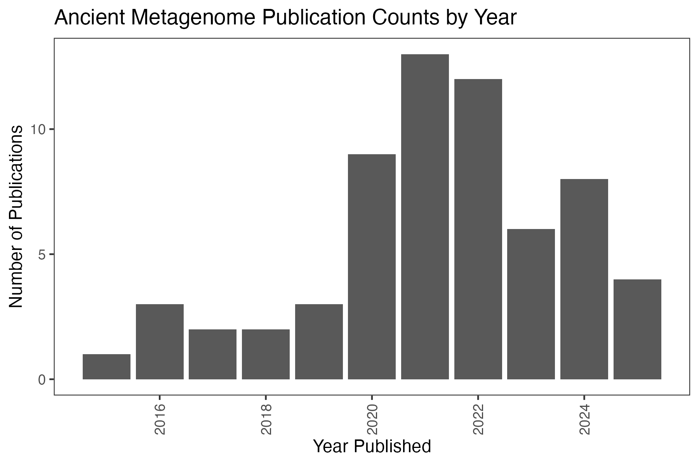
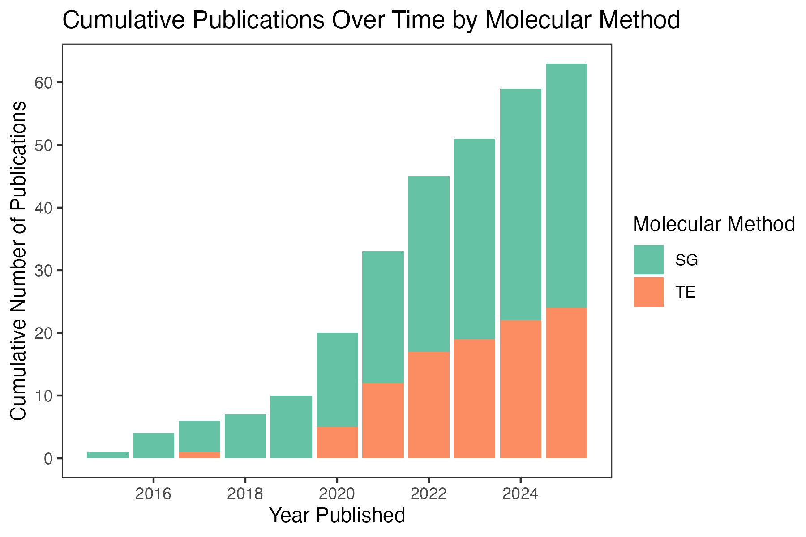

# Holi: A Holistic Pipeline for Ancient Metagenomics

Holi is a versatile bioinformatic pipeline designed for the analysis of ancient metagenomic data. It integrates tools for processing raw sequence reads, taxonomic classification, authenticity assessment, and results visualization, making it a solution for researchers working with ancient eDNA (aeDNA) and more specifically interested in the eukaryotes.

With a focus on the challenges unique to ancient metagenomics, such as low-quality and damaged DNA, Holi attempts accurate identification of taxa using a competitive setup, authentication of ancient DNA patterns, genome/reference-wide statistics and metrics for eventual reporting.

Below you can find both a bash script guide for running the pipeline and a slurm sbash version of the same. For the details and explanations please visit the [wiki](https://github.com/miwipe/Holi/wiki).
### Bash scripts

## Litterature to-date
Ancient metagenomic analysis of eukaryotes, particularly through shotgun sequencing, began gaining traction around 2016, marking a significant shift in how researchers study past ecosystems and evolutionary processes. Unlike microbial and viral ancient DNA studies, which have a longer history, the recovery and analysis of ancient eukaryotic DNA from complex environmental and archaeological samples remain a relatively new and rapidly developing field. This research line is expanding in diverse applications, including the reconstruction of past biodiversity, tracking the evolution of parasites and symbionts, understanding ancient food webs, and shedding light on human-animal-plant interactions over time. With continued advancements in sequencing technology and bioinformatics, ancient eukaryotic metagenomics is poised to reveal deeper insights into past life and environmental changes.

We have here collected all publications that have worked with ancient metagenomic data (excluding metabarcoding data) and focused on the eukaryotic fraction. This list of papers builds upon and expands the already collected literature in the [Inventory of ancient environmental DNA from sedimentary archives: locations, methods, and target taxa](https://zenodo.org/records/13761348). We have expanded the list not only with the most recent publications, but also including other environmental sources than sediments. We define ancient environmental samples as a sample that contains genetic material from more than one unknown organism, hence this can be everything from coprolites, stalagmites to sedimentary deposits. Furthermore, we have added additional information that relates to the analytical side of the studies such as: databases used, analytical approach (shotgun/capture enrichment) and bioinformatic tools used to trim, qc, map and authenticate the ancient DNA sequences. Please note, that studies with capture enrichment can also have shotgun sequenced data, but not the other way around.

Our hope is that this can be a continously updated resource and be valuable for the community as such. The list can be found [here](https://docs.google.com/spreadsheets/d/13cmBUi4cigUaTKtQeFLFvS0gXT8AeWxWKzHv2UcOBCI/edit?usp=sharing). Feel free to comment in this google sheet if you find errors and/or missing papers. Below you can find a figure digest of where in the world studies have been conducted and how many publications are published every year as well as the proportion of studies using the two main analytical strategies. 

