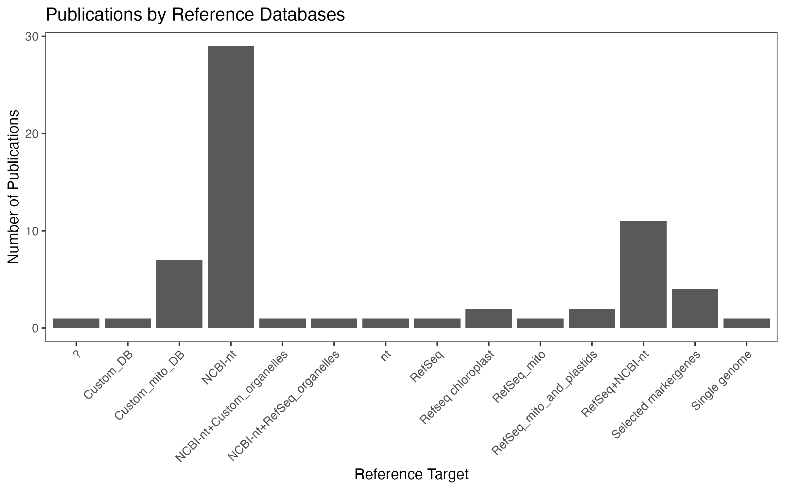
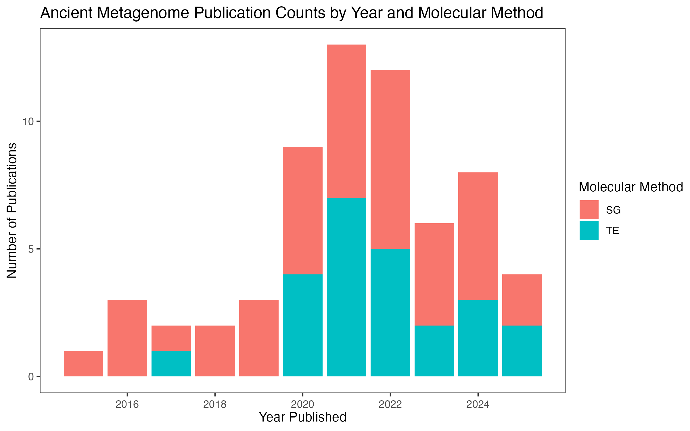

# Holi: A Holistic Pipeline for Ancient Metagenomics
Holi is a versatile bioinformatic pipeline designed for the analysis of ancient metagenomic data. It integrates tools for processing raw sequence reads, taxonomic classification, authenticity assessment, and results visualization, making it a solution for researchers working with ancient eDNA (aeDNA) and more specifically interested in the eukaryotes.

With a focus on the challenges unique to ancient metagenomics, such as low-quality and damaged DNA, Holi attempts accurate identification of taxa using a competitive setup, authentication of ancient DNA patterns, genome/reference-wide statistics and metrics for eventual reporting.


**The Holi workflow**

Below you can find both a bash script guide for running the pipeline and a slurm sbash version of the same. For the details and explanations please visit the [wiki](https://github.com/miwipe/Holi/wiki).
### Bash scripts

## Literature to-date
Ancient metagenomic analysis of eukaryotes, particularly through shotgun sequencing, began gaining traction around 2016, marking a significant shift in how researchers study past ecosystems and evolutionary processes. Unlike microbial and viral ancient DNA studies, which have a longer history, the recovery and analysis of ancient eukaryotic DNA from complex environmental and archaeological samples remain a relatively new and rapidly developing field. This research area is expanding into diverse applications, including the reconstruction of past biodiversity, tracking the evolution of parasites and symbionts, understanding ancient food webs, and shedding light on human-animal-plant interactions over time. With continued advancements in sequencing technology and bioinformatics, ancient eukaryotic metagenomics is poised to reveal deeper insights into past life and environmental changes.

Here, we have compiled all publications that have analyzed ancient metagenomic data (excluding metabarcoding data) with a focus on the eukaryotic fraction [link to spreadsheet with list](https://docs.google.com/spreadsheets/d/13cmBUi4cigUaTKtQeFLFvS0gXT8AeWxWKzHv2UcOBCI/edit?usp=sharing). This list builds upon and expands the existing literature collected in the Inventory of ancient environmental DNA from sedimentary archives: locations, methods, and target taxa (doi 10.5281/zenodo.6847521). Our updated compilation not only includes the most recent publications but also broadens the scope to include environmental sources beyond sediments.

We define ancient environmental samples as those containing genetic material from more than one unknown organism, which can include sources such as coprolites, stalagmites, and sedimentary deposits. Additionally, we have enriched the dataset with details on analytical methodologies, including databases used, sequencing strategies (shotgun sequencing vs. capture enrichment), and the bioinformatic tools applied for trimming, quality control, mapping, and authentication of ancient DNA sequences. It is important to note that studies employing capture enrichment may also include shotgun-sequenced data, but not vice versa.

Our aim is for this resource to be continuously updated and valuable to the research community. The complete list is available [here](https://docs.google.com/spreadsheets/d/13cmBUi4cigUaTKtQeFLFvS0gXT8AeWxWKzHv2UcOBCI/edit?usp=sharing). If you find errors or missing publications, feel free to leave comments in the Google Sheet. Below, we provide a visual summary of where studies have been conducted worldwide, the annual publication trends, and the proportion of studies employing the two main analytical strategies.





---

## How to Run the R Script for Visualization

This repository includes an R script that generates the visualizations shown above, using data sourced from a shared Google Sheet.

### To run and plot the figures clone the git repo

```
git clone https://github.com/miwipe/Holi.git
```

Now open the R project (sedaDNA_litterature.Rproj) in your terminal or in the Rstudio GUI, and run through the generate_figures.R script.

 


